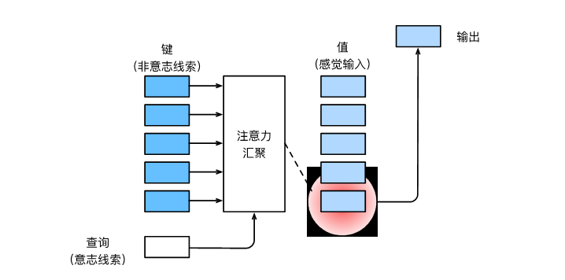

# Transformer

## 注意力提示

### 查询、键和值

只使⽤⾮⾃主性提⽰：要想将选择偏向于感官输⼊，我们可以简单地使⽤参数化的全连接层，甚⾄是⾮参数化的最⼤汇聚层或平均汇聚层。

因此，“是否包含⾃主性提⽰”将注意⼒机制与全连接层或汇聚层区别开来。在注意⼒机制的背景下，我们将⾃主性提⽰称为查询（query）。给定任何查询，注意⼒机制通过注意⼒汇聚（attention pooling）将选择引导⾄感官输⼊（sensory inputs，例如中间特征表⽰）。在注意⼒机制中，这些感官输⼊被称为值（value）。更通俗的解释，每个值都与⼀个键（key）配对，这可以想象为感官输⼊的⾮⾃主提⽰。我们可以设计注意⼒汇聚，以便给定的查询（⾃主性提⽰）可以与键（⾮⾃主性提⽰）进⾏匹配，这将引导得出最匹配的值（感官输⼊）。

• ⼈类的注意⼒是有限的、有价值和稀缺的资源。
• 受试者使⽤⾮⾃主性和⾃主性提⽰有选择性地引导注意⼒。前者基于突出性，后者则依赖于意识。
• 注意⼒机制与全连接层或者汇聚层的区别源于增加的⾃主提⽰。
• 由于包含了⾃主性提⽰，注意⼒机制与全连接的层或汇聚层不同。
• 注意⼒机制通过注意⼒汇聚使选择偏向于值（感官输⼊），其中包含查询（⾃主性提⽰）和键（⾮⾃主
性提⽰）。键和值是成对的。
• 我们可以可视化查询和键之间的注意⼒权重。

## 注意力汇聚：Nadaraya-Watson回归

### 不带参数

Nadaraya和Watson提出了⼀个想法，根据输⼊的位置对输出$$y_i$$进⾏加权：
$$f(x) = \overset{n}{\underset{i=1}{\sum}}\frac{K(x-x_i)}{∑_{j=1}^n K(x-xj)}y_i$$ （1）  

其中K是核（kernel）。公式(1)所描述的估计器被称为Nadaraya-Watson核回归（Nadaraya-Watson kernel
regression）。这⾥我们不会深⼊讨论核函数的细节，但受此启发，我们可以从注意⼒机制框架的⻆度重写(1)，成为⼀个更加通⽤的注意⼒汇聚（attention pooling）公式：
$$ f(x) =\overset{n}{\underset{i=1}{\sum}}\alpha(x; x_i)y_i $$ （2）
其中$$x$$是查询，$$(x_i; y_i)$$是键值对。注意⼒汇聚是$$y_i$$的加权平均。将查询$$x$$和键$$x_i$$之间的关系建模为注意⼒权重(attention weight)$$\alpha(x; xi)$$，如(2)所⽰，这个权重将被分配给每⼀个对应值$$y_i$$。对于任何查询，模型在所有键值对注意⼒权重都是⼀个有效的概率分布：它们是⾮负的，并且总和为1。
为了更好地理解注意⼒汇聚，我们考虑⼀个⾼斯核（Gaussian kernel），其定义为：
$$K(u) = \frac{1}{\sqrt{2\pi}}exp(-\frac{\mu^2}{2})$$
将⾼斯核代⼊(1)和(2)可以得到：
$$\begin{aligned} f(x) &=\sum_{i=1}^n \alpha(x, x_i) y_i\\ &= \sum_{i=1}^n \frac{\exp\left(-\frac{1}{2}(x - x_i)^2\right)}{\sum_{j=1}^n \exp\left(-\frac{1}{2}(x - x_j)^2\right)} y_i \\&= \sum_{i=1}^n \mathrm{softmax}\left(-\frac{1}{2}(x - x_i)^2\right) y_i. \end{aligned}$$   (3)
在(3)中，如果⼀个键$$x_i$$越是接近给定的查询x，那么分配给这个键对应值$$y_i$$的注意⼒权重就会越⼤，也
就“获得了更多的注意⼒”。
值得注意的是，Nadaraya-Watson核回归是⼀个⾮参数模型。因此，(3)是⾮参数的注意⼒汇聚（nonparametric attention pooling）模型。

### 带参数

在下面的查询$x$和键$x_i$之间的距离乘以可学习参数$w$：

$$\begin{aligned}f(x) &= \sum_{i=1}^n \alpha(x, x_i) y_i \\&= \sum_{i=1}^n \frac{\exp\left(-\frac{1}{2}((x - x_i)w)^2\right)}{\sum_{j=1}^n \exp\left(-\frac{1}{2}((x - x_j)w)^2\right)} y_i \\&= \sum_{i=1}^n \mathrm{softmax}\left(-\frac{1}{2}((x - x_i)w)^2\right) y_i.\end{aligned}$$

• Nadaraya-Watson核回归是具有注意⼒机制的机器学习范例。
• Nadaraya-Watson核回归的注意⼒汇聚是对训练数据中输出的加权平均。从注意⼒的⻆度来看，分配给每个值的注意⼒权重取决于将值所对应的键和查询作为输⼊的函数。
• 注意⼒汇聚可以分为⾮参数型和带参数型。  

## 注意力评分函数

使用高斯核来对查询和键之间的关系建模，可以将核回归中的高斯核指数部分视为*注意力评分函数*（attention scoring function），简称*评分函数*（scoring function），然后把这个函数的输出结果输入到$$softmax$$函数中进行运算。通过上述步骤，我们将得到与键对应的值的概率分布（即注意力权重）。最后，注意力汇聚的输出就是基于这些注意力权重的值的加权和。

其中$a$表示注意力评分函数。由于注意力权重是概率分布，因此加权和其本质上是加权平均值。

用数学语言描述，假设有一个查询$$\mathbf{q} \in \mathbb{R}^q$$和$$m$$个“键－值”对$$(\mathbf{k}_1, \mathbf{v}_1), \ldots, (\mathbf{k}_m, \mathbf{v}_m)$$，
其中$$\mathbf{k}_i \in \mathbb{R}^k$$，$$\mathbf{v}_i \in \mathbb{R}^v$$。注意力汇聚函数$$f$$就被表示成值的加权和：

$$f(\mathbf{q}, (\mathbf{k}_1, \mathbf{v}_1), \ldots, (\mathbf{k}_m, \mathbf{v}_m)) = \sum_{i=1}^m \alpha(\mathbf{q}, \mathbf{k}_i) \mathbf{v}_i \in \mathbb{R}^v,$$

其中查询$\mathbf{q}$和键$\mathbf{k}_i$的注意力权重（标量）是通过注意力评分函数$a$ 将两个向量映射成标量，再经过$$softmax$$运算得到的：

$$\alpha(\mathbf{q}, \mathbf{k}_i) = \mathrm{softmax}(a(\mathbf{q}, \mathbf{k}_i)) = \frac{\exp(a(\mathbf{q}, \mathbf{k}_i))}{\sum_{j=1}^m \exp(a(\mathbf{q}, \mathbf{k}_j))} \in \mathbb{R}.$$

### 掩蔽$$softmax$$操作

正如上⾯提到的， $$softmax$$操作⽤于输出⼀个概率分布作为注意⼒权重。在某些情况下，并⾮所有的值都应该被纳⼊到注意⼒汇聚中。例如，为了⾼效处理⼩批量数据集，某些⽂本序列被填充了没有意义的特殊词元。为了仅将有意义的词元作为值来获取注意⼒汇聚，我们可以指定⼀个有效序列⻓度（即词元的个数），以便在计算$$softmax$$时过滤掉超出指定范围的位置。通过这种⽅式，我们可以设定的$$masked_softmax$$函数中实现这样的掩蔽$$softmax$$操作（$$masked\ \  softmax\ \  operation$$），其中任何超出有效⻓度的位置都被掩蔽并置为0。  

### 加权注意力

一般来说，当查询和键是不同长度的矢量时，我们可以使用加性注意力作为评分函数。
给定查询$$\mathbf{q} \in \mathbb{R}^q$$和键$$\mathbf{k} \in \mathbb{R}^k$$，*加性注意力*（additive attention）的评分函数为

$$a(\mathbf q, \mathbf k) = \mathbf w_v^\top \text{tanh}(\mathbf W_q\mathbf q + \mathbf W_k \mathbf k) \in \mathbb{R},$$

其中可学习的参数是$$\mathbf W_q\in\mathbb R^{h\times q}$$、$$\mathbf W_k\in\mathbb R^{h\times k}$$和$$\mathbf w_v\in\mathbb R^{h}$$。将查询和键连结起来后输入到一个多层感知机（$$MLP$$）中，感知机包含一个隐藏层，其隐藏单元数是一个超参数$$h$$。通过使用$$\tanh$$作为激活函数，并且禁用偏置项。

### 缩放点积注意力

使用点积可以得到计算效率更高的评分函数，但是点积操作要求查询和键具有相同的长度$$d$$。假设查询和键的所有元素都是独立的随机变量，并且都满足零均值和单位方差，
那么两个向量的点积的均值为$$0$$，方差为$$d$$。为确保无论向量长度如何，点积的方差在不考虑向量长度的情况下仍然是$$1$$，将点积除以$$\sqrt{d}$$，则*缩放点积注意力*（scaled dot-product attention）评分函数为：

$$a(\mathbf q, \mathbf k) = \mathbf{q}^\top \mathbf{k}  /\sqrt{d}.$$

在实践中，我们通常从小批量的角度来考虑提高效率，例如基于$$n$$个查询和$$m$$个键－值对计算注意力，其中查询和键的长度为$$d$$，值的长度为$$v$$。查询$$\mathbf Q\in\mathbb R^{n\times d}$$、键$$\mathbf K\in\mathbb R^{m\times d}$$和值$$\mathbf V\in\mathbb R^{m\times v}$$的缩放点积注意力是：

$$ \mathrm{softmax}\left(\frac{\mathbf Q \mathbf K^\top }{\sqrt{d}}\right) \mathbf V \in \mathbb{R}^{n\times v}.$$

* 将注意⼒汇聚的输出计算可以作为值的加权平均，选择不同的注意⼒评分函数会带来不同的注意⼒汇聚操作。
* 当查询和键是不同⻓度的⽮量时，可以使⽤可加性注意⼒评分函数。当它们的⻓度相同时，使⽤缩放的“点－积”注意⼒评分函数的计算效率更⾼。  

